Bandit Level 0

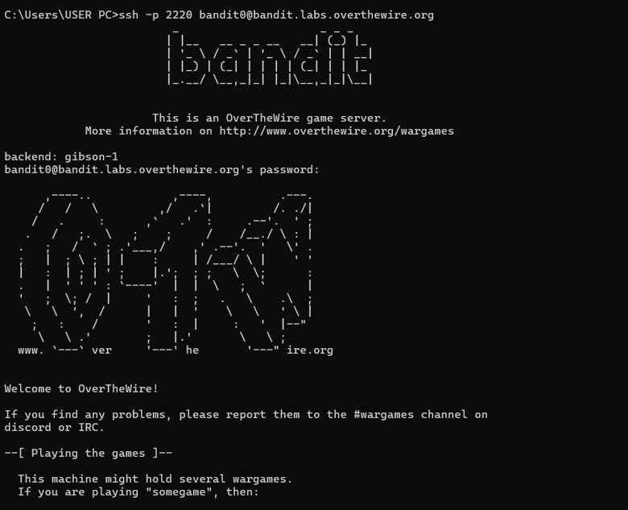

Bandit Level 0 → Level 1

Goal: Login to the Bandit server using SSH.

Command :ssh bandit0@bandit.labs.overthewire.org -p 2220

Skills learned:

·       SSH connection

·       Remote server access

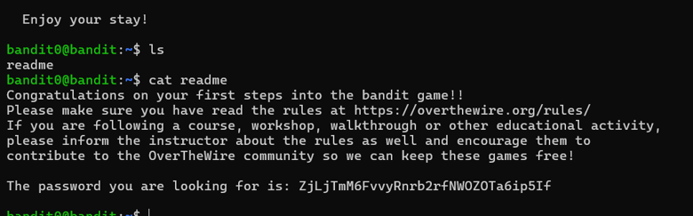

Bandit Level 1 → Level 2

Goal: Read a file named "-" (special filename).

Command: cat ./-

Skills learned: Handling special filenames

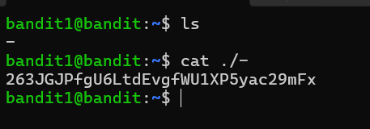

Bandit Level 2 → Level 3

Goal: Read a file with spaces in its name.

Command: cat "spaces in this filename"

Skills learned: Escaping spaces in filenames

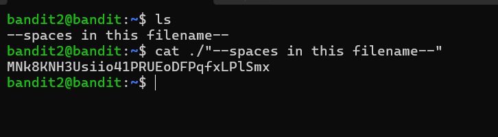

Bandit Level 3 → Level 4

Goal: Find a hidden file.

Command:

·       ls -a

·       cat .hidden

Skills learned: Hidden files in Linux

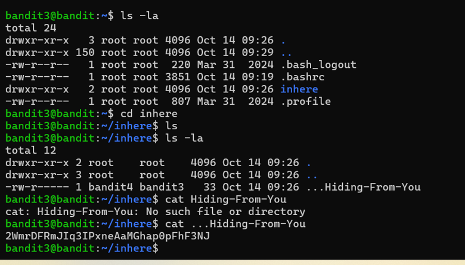

Bandit Level 4 → Level 5

Goal: Find the human readable file.

Command: file ./*

Skills learned: Identifying file types

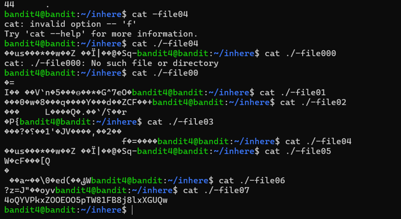

Bandit Level 5 → Level 6

Goal: Find a file with specific size and permissions.

Command: find . -type f -size 1033c ! -executable

Skills learned: Using the find command

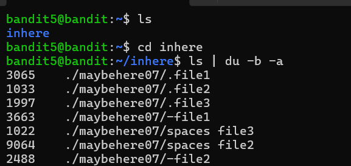

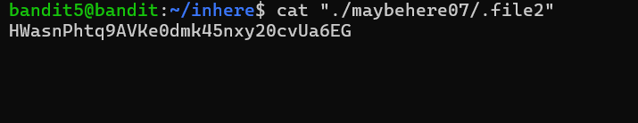

Bandit Level 6 → Level 7

Goal: Find a file owned by specific user and group.

Command: find / -user bandit7 -group bandit6 2>/dev/null

Skills learned:Searching system-wide files

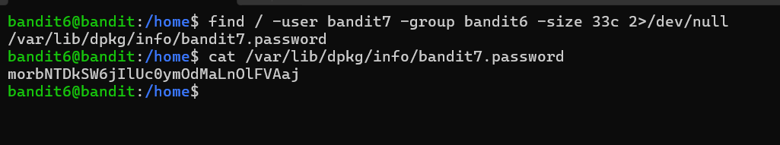

Bandit Level 7 → Level 8

Goal: Find the line containing the word "millionth".

Command: grep millionth data.txt

Skills learned: Text searching with grep

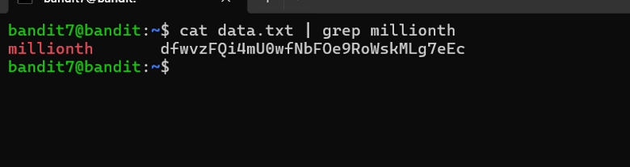

Bandit Level 8 → Level 9

Goal: Find the unique line.

Command: sort data.txt | uniq -u

Skills learned: Sorting and filtering text

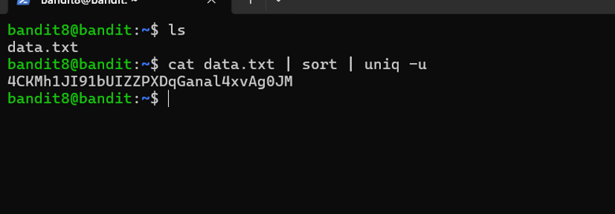

Bandit Level 9 → Level 10

Goal:Extract readable strings.

Command: strings data.txt | grep ===

Skills learned: Extracting readable strings

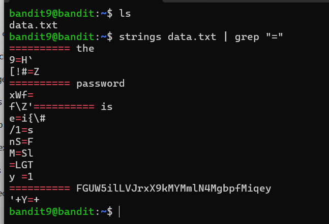

Bandit Level 10 → Level 11

Goal: Decode base64 data.  
Command: base64 -d data.txt  
Skills learned: Base64 decoding

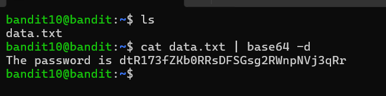

Bandit Level 11 → Level 12

Goal: Decode ROT13 text.  
command: tr  
Skills learned: Simple cipher decoding

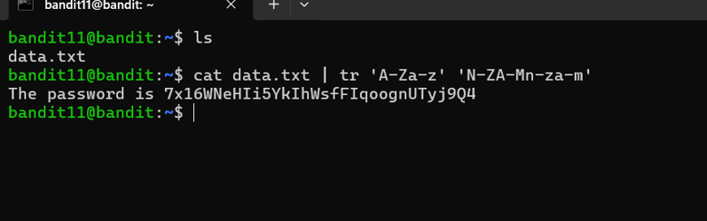

Bandit Level 12 → Level 13

Goal:Extract data from multiple compressed files.

Commands:

·       xxd

·       gzip

·       bzip2

·       tar

Skills learned:

·       File extraction

·       Compression formats

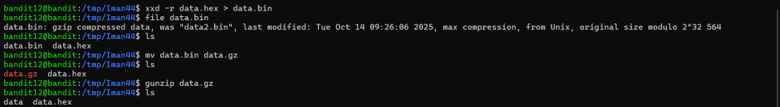

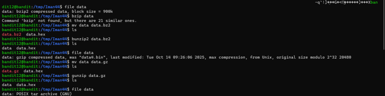  

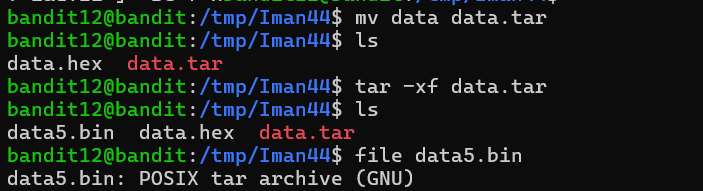  

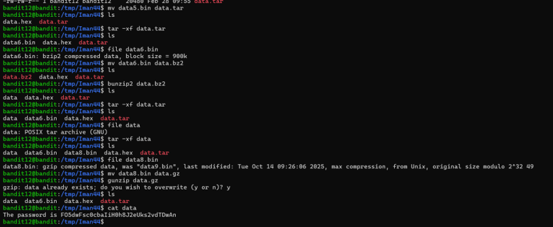

Bandit Level 13 → Level 14

Goal: Use private SSH key to login.  
Command: ssh -i sshkey.private bandit14@localhost -p 2220  
Skills learned: SSH key authentication

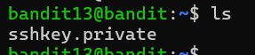  

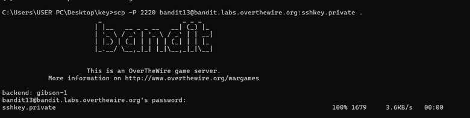  

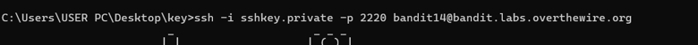  

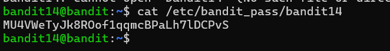

Bandit Level 14 → Level 15

Goal: Send password to a port.  
Command: nc localhost 30000  
Skills learned: Using netcat

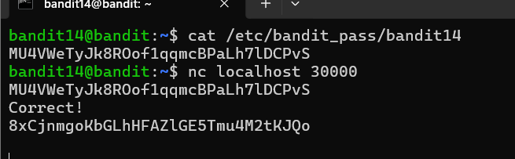

Bandit Level 15 → Level 16

Goal: Connect using SSL.  
Command: openssl s_client -connect localhost:30001  
Skills learned: SSL connections

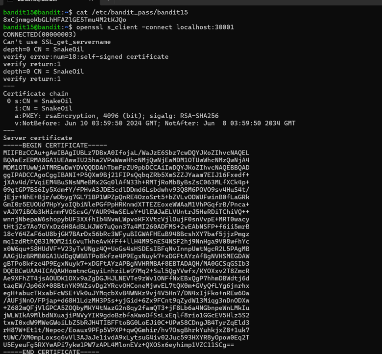  

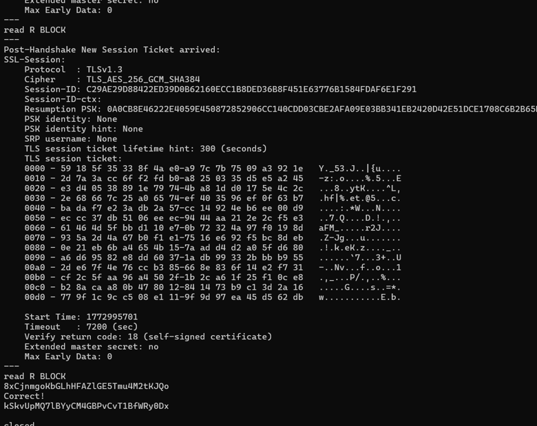

Bandit Level 16 → Level 17

Goal: Scan open ports.  
Command: nmap -p 31000-32000 localhost  
Skills learned: Port scanning

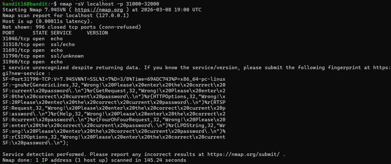  

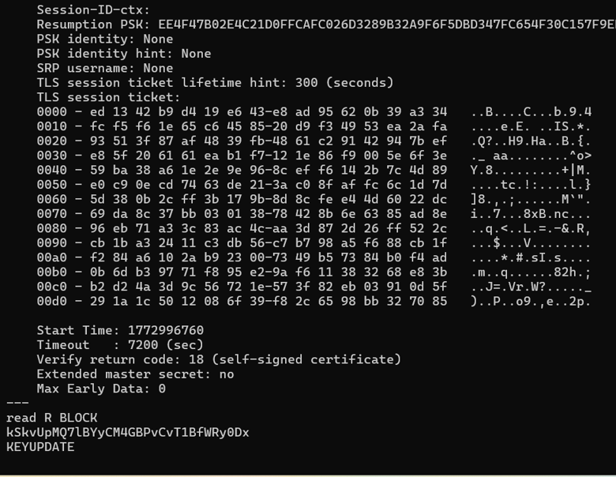  

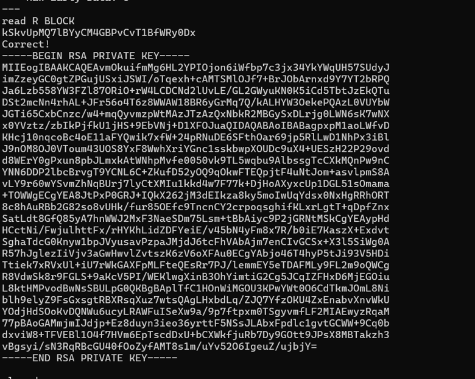  

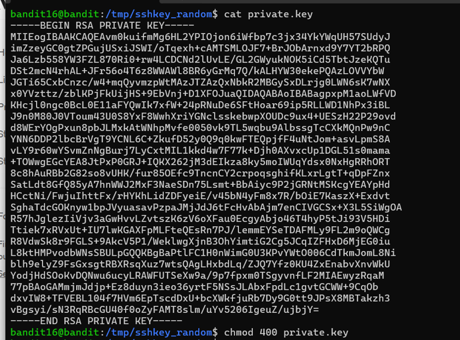  

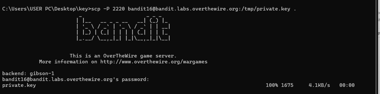

Bandit Level 17 → Level 18

Goal: Find difference between files.  
Command: diff passwords.old passwords.new  
Skills learned: Comparing files

  

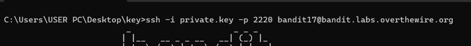

Bandit Level 18 → Level 19

Goal: Execute command despite restricted shell.  
Command: ssh bandit18@bandit.labs.overthewire.org -p 2220 cat readme  
Skills learned: Running remote commands

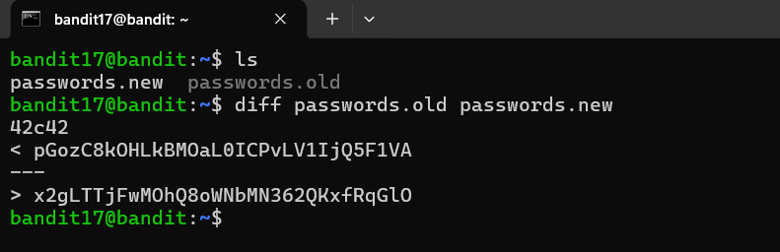

Bandit Level 19 → Level 20

Goal: Use setuid program.  
Command: ./bandit20-do cat /etc/bandit_pass/bandit20  
Skills learned: Privilege escalation basics

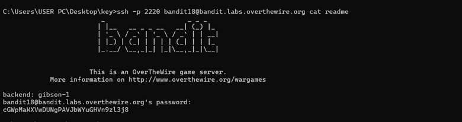

Bandit Level 20 → Level 21

Goal: Use netcat listener.  
Commands: nc -lvp port  
Skills learned: Network communication

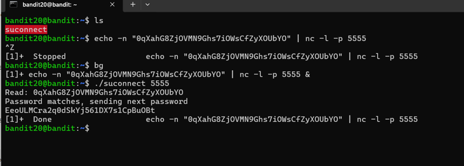

Bandit Level 21 → Level 22

Goal: Read cron job script.  
Command: cat /etc/cron.d/...  
Skills learned: Cron jobs analysis

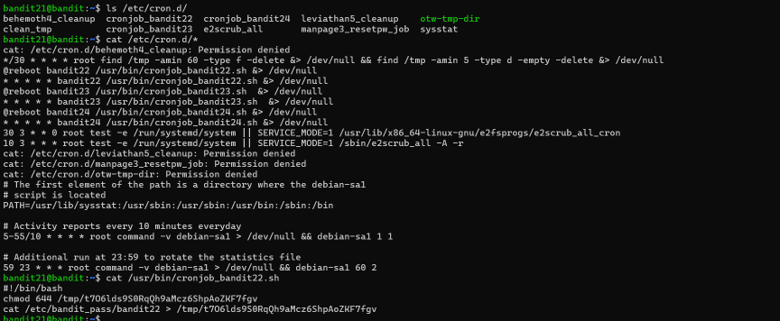  

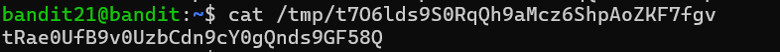

Bandit Level 22 → Level 23

Goal: Read cron job script.  
Command: cat /etc/cron.d/cronjob_bandit23  
Skills learned: Cron jobs analysis

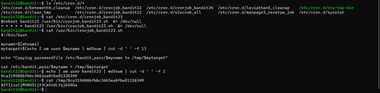

Bandit Level 23 → Level 24

Goal: Read cron job script location.  
Command: cat /usr/bin/cronjob_bandit23.sh  
Skills learned: Script analysis

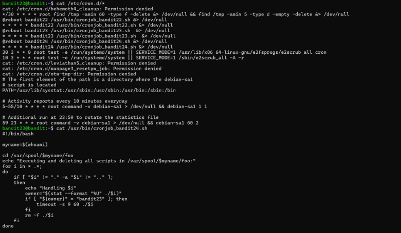

mkdir /tmp/iman99999

chmod 777 /tmp/iman99999

cd /tmp/iman99999

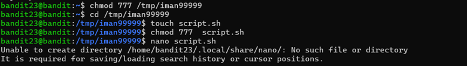

#!/bin/bash  
cat /etc/bandit_pass/bandit24 > /tmp/gameplan1/password

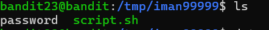  

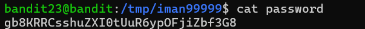

Bandit Level 24 → Level 25

Goal: Brute force the PIN code.  
Command: nc localhost 30002  
Skills learned: Brute force basics

Cd /tmp/iman99999

nano brute.sh

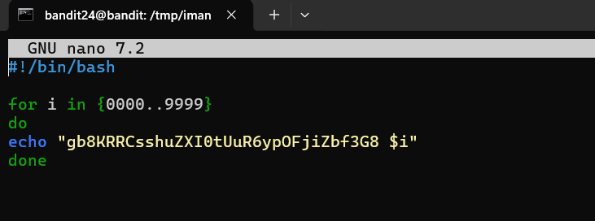

chmod +x brute.sh

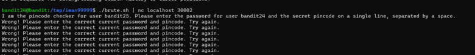  

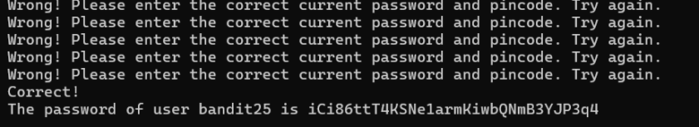

Bandit Level 25 → Level 26

Goal: Escape restricted shell.  
Command: v (inside more → opens vim)  
Skills learned: Shell escape

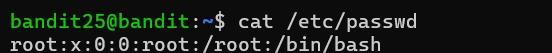  

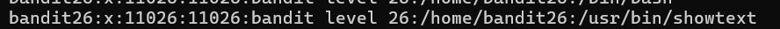  

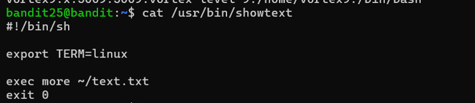  

  

Bandit Level 26 → Level 27

Goal: Spawn a shell from vim.  
Command: :shell  
Skills learned: Vim shell access

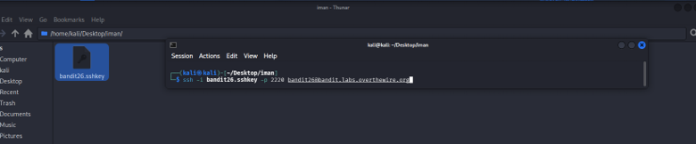  

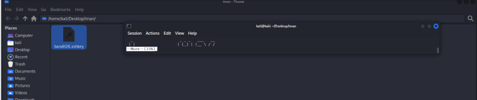

Press v to inters vim text editor mode

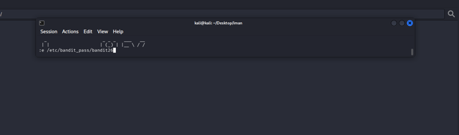

Enter

Password level 26:

Enter again

:set shell=/bin/bash

shell

  

Ls -la

  

